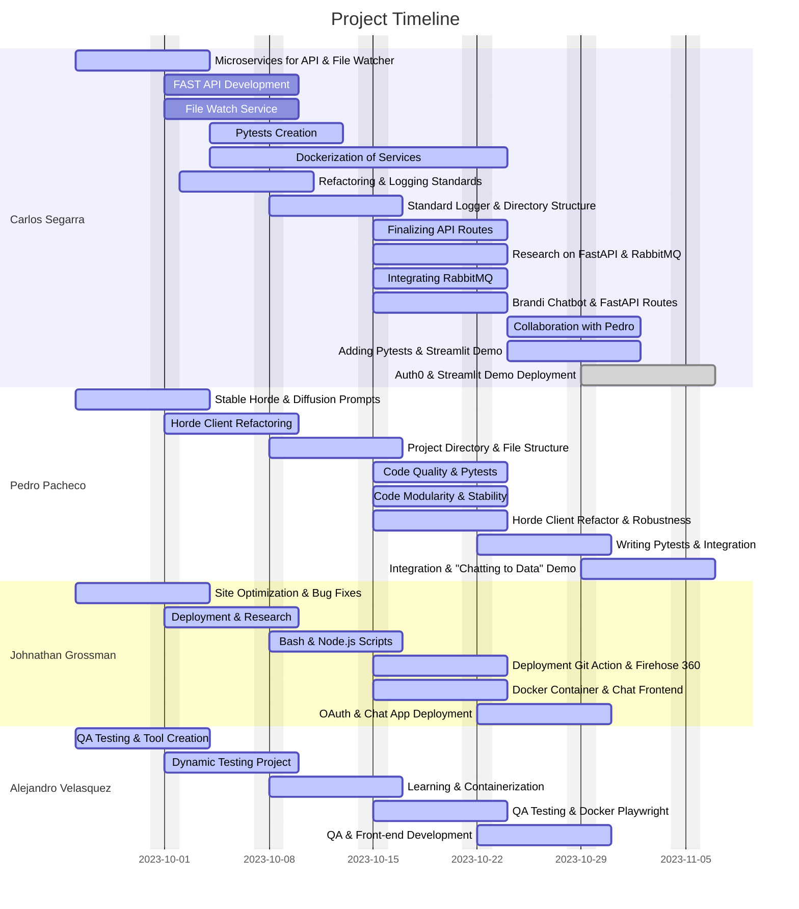

# AWS

```mermaid
gantt
title Project Timeline
dateFormat YYYY-MM-DD
excludes weekends
section Carlos Segarra
Microservices for API & File Watcher     :active, des1, 2023-09-25, 7d
FAST API Development                    :after des1, 2023-10-01, 7d
File Watch Service                      :after des1, 2023-10-01, 7d
Pytests Creation                        :active, after des1, 7d
Dockerization of Services               :active, after des1, 14d
Refactoring & Logging Standards         :active, des2, 2023-10-02, 7d
Standard Logger & Directory Structure   :active, after des2, 2023-10-08, 7d
Finalizing API Routes                   :active, after des2, 2023-10-15, 7d
Research on FastAPI & RabbitMQ          :active, after des2, 2023-10-15, 7d
Integrating RabbitMQ                    :active, after des2, 2023-10-15, 7d
Brandi Chatbot & FastAPI Routes         :active, des3, 2023-10-15, 7d
Collaboration with Pedro                :active, after des3, 7d
Adding Pytests & Streamlit Demo         :active, after des3, 7d
Auth0 & Streamlit Demo Deployment       :done, after des3, 2023-10-29, 7d

section Pedro Pacheco
Stable Horde & Diffusion Prompts        :active, ped1, 2023-09-25, 7d
Horde Client Refactoring                :active, after ped1, 2023-10-01, 7d
Project Directory & File Structure      :active, after ped1, 2023-10-08, 7d
Code Quality & Pytests                  :active, after ped1, 2023-10-15, 7d
Code Modularity & Stability             :active, after ped1, 2023-10-15, 7d
Horde Client Refactor & Robustness      :active, ped2, 2023-10-15, 7d
Writing Pytests & Integration           :active, after ped2, 2023-10-22, 7d
Integration & "Chatting to Data" Demo   :active, after ped2, 2023-10-29, 7d

section Johnathan Grossman
Site Optimization & Bug Fixes           :active, jon1, 2023-09-25, 7d
Deployment & Research                   :active, after jon1, 2023-10-01, 7d
Bash & Node.js Scripts                  :active, after jon1, 2023-10-08, 7d
Deployment Git Action & Firehose 360    :active, after jon1, 2023-10-15, 7d
Docker Container & Chat Frontend        :active, jon2, 2023-10-15, 7d
OAuth & Chat App Deployment             :active, after jon2, 2023-10-22, 7d

section Alejandro Velasquez
QA Testing & Tool Creation              :active, ale1, 2023-09-25, 7d
Dynamic Testing Project                 :active, after ale1, 2023-10-01, 7d
Learning & Containerization             :active, after ale1, 2023-10-08, 7d
QA Testing & Docker Playwright          :active, after ale1, 2023-10-15, 7d
QA & Front-end Development              :active, ale2, 2023-10-22, 7d

```
